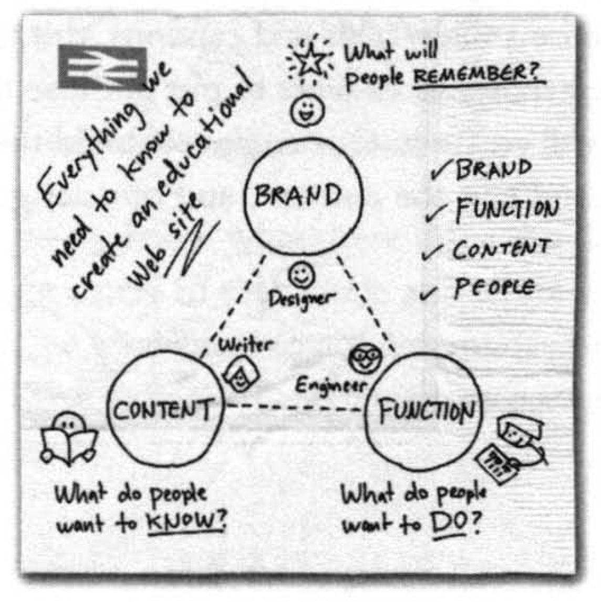

# [A Complete Jersey Guide Book](https://qubitpi.github.io/jersey-guide/)

I was reading a very nicely-written book the other day, called
"[The Back of the Napkin: Solving Problems and Selling Ideas with Pictures](https://www.goodreads.com/book/show/2420301.The_Back_of_the_Napkin)".

The book began with a situation that many people had trouble with - "lots of people these days are very confused about
how to create a useful Web site". With some interesting narratives there came a little beautiful napkin-picture as a
solution:

It doesn't look *little* but that's something you should talk about with a markdown inventor the other day, but my point
is - I was truly attracted by this napkin-pictured idea and I'd like to put this idea into practice; so here
came to this [Jersey Guide](https://qubitpi.github.io/jersey-guide/), which I think it's an absolutely wonderful guide.
Jersey has been an industry standard for standing up Webservices; I love it; and you shall find it pretty useful
to learn and play with, believe me~

# License

The use and distribution terms for this software are covered by the Apache License, Version 2.0
( http://www.apache.org/licenses/LICENSE-2.0.html ).
